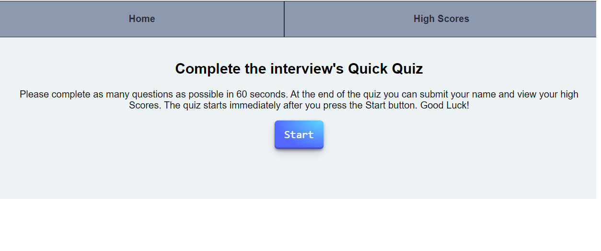
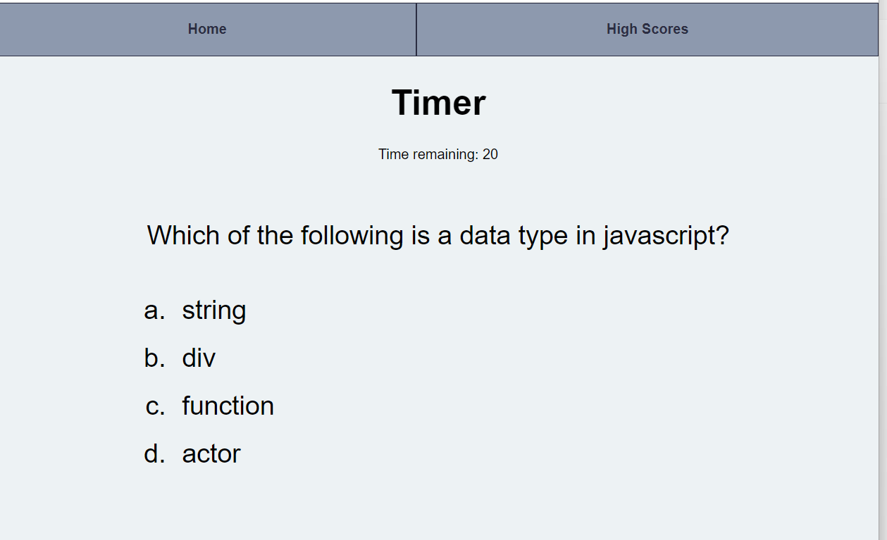
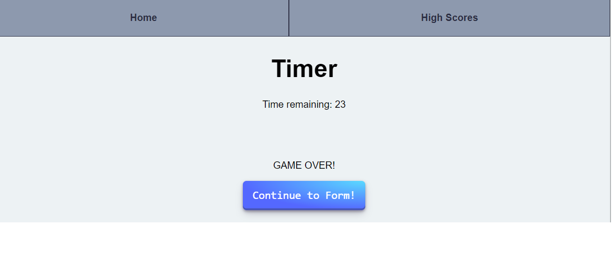
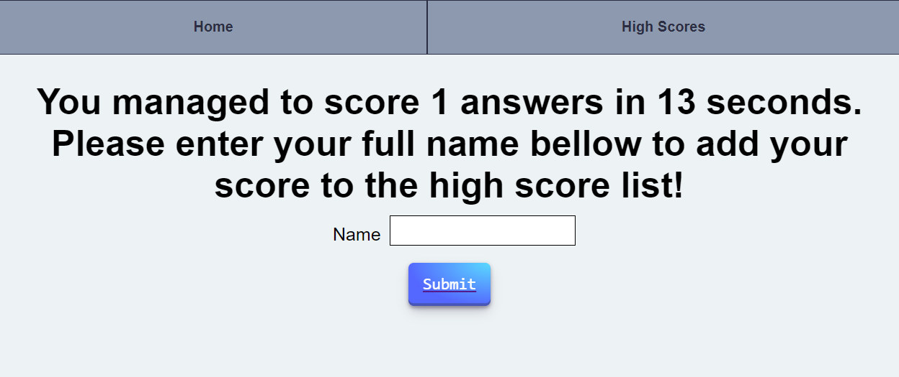
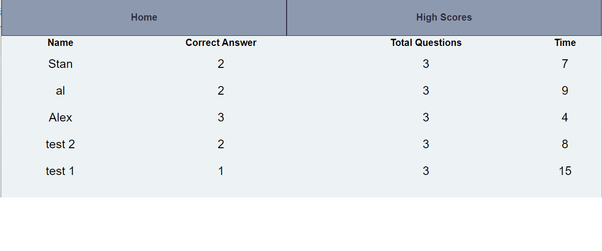

# 04 Web APIs: Code Quiz

## Description

The application is a short quiz, when the start button is pressed the user will have 10 seconds to answer each of the quiz questions, if the answer is incorrect 5 seconds will be deducted from the timer.If the timer reaches 0 or the user finishes the question the game over page will be displayed. The use will then have the option to continue to the form section.
The form section will display a short description of the quiz result and a input box to add the user name. After submitting the form the user will be redirected to the high score page where the quiz result will be displayed in a tabular form alongside all the previous quiz result saved in local storage.

## User Story

```
AS A coding boot camp student
I WANT to take a timed quiz on JavaScript fundamentals that stores high scores
SO THAT I can gauge my progress compared to my peers
```

## Acceptance Criteria

```
GIVEN I am taking a code quiz
WHEN I click the start button
THEN a timer starts and I am presented with a question
WHEN I answer a question
THEN I am presented with another question
WHEN I answer a question incorrectly
THEN time is subtracted from the clock
WHEN all questions are answered or the timer reaches 0
THEN the game is over
WHEN the game is over
THEN I can save my initials and my score
```

## Mock-Up

The following pictures show the quiz application components:






